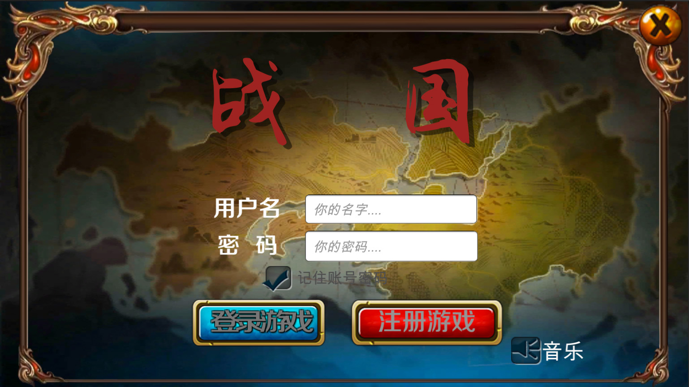
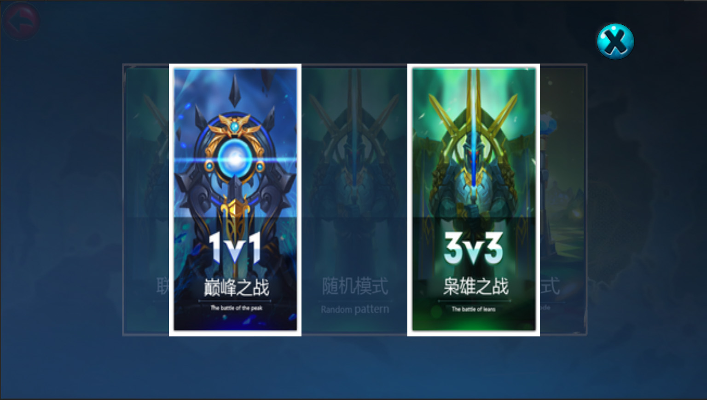
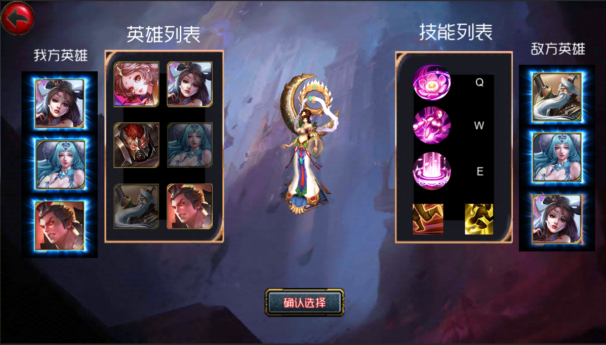
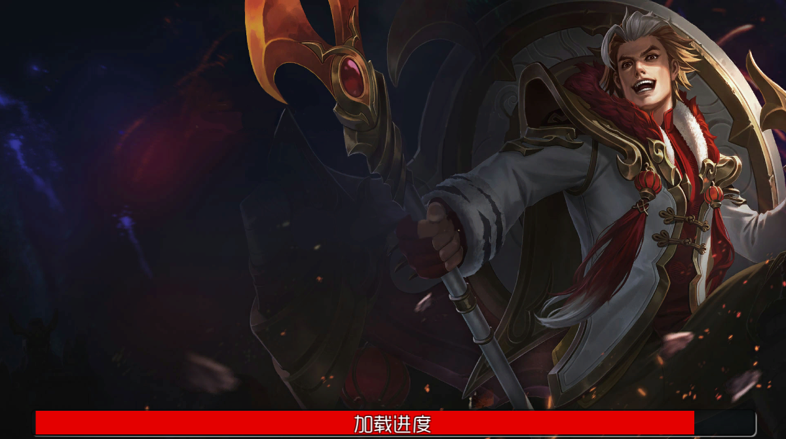
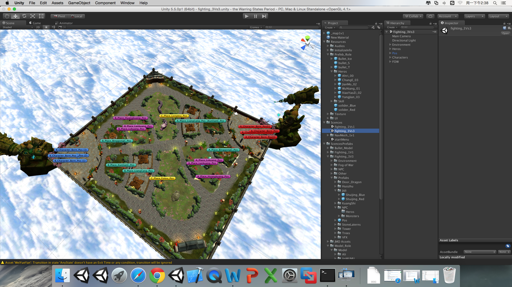
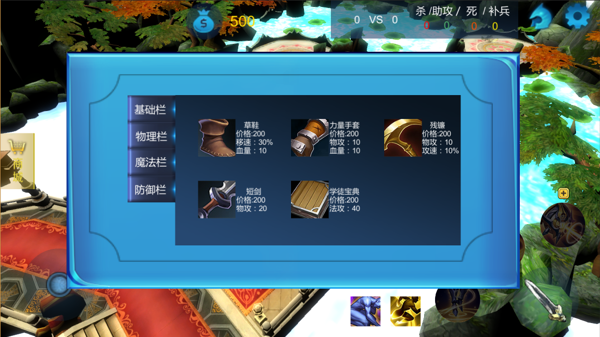
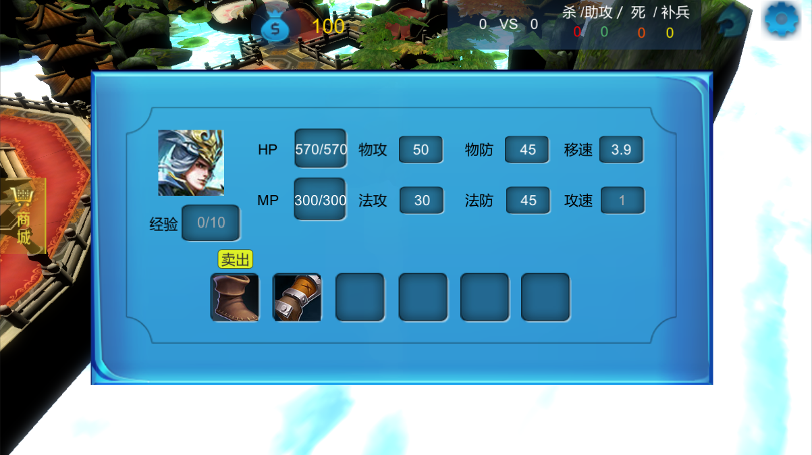
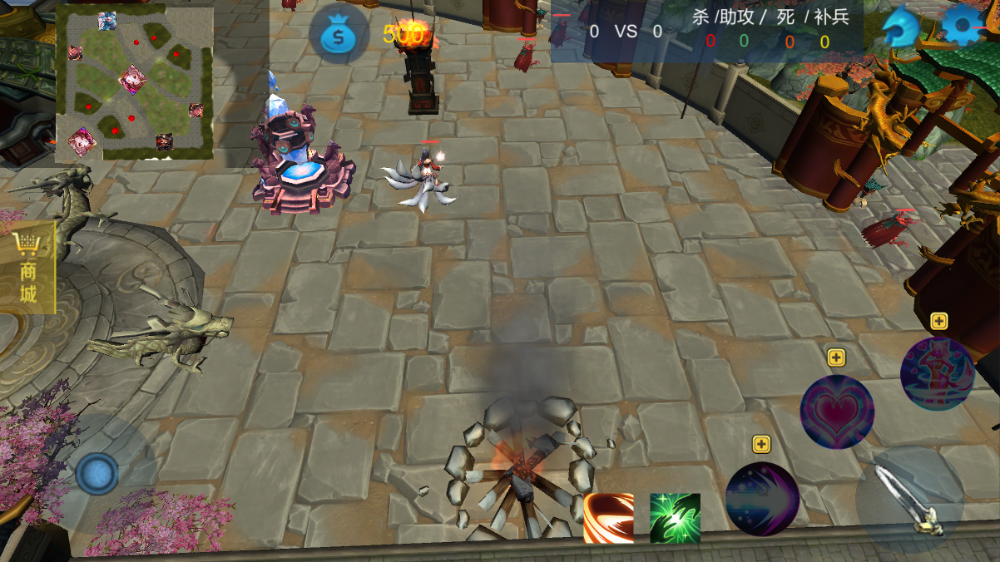
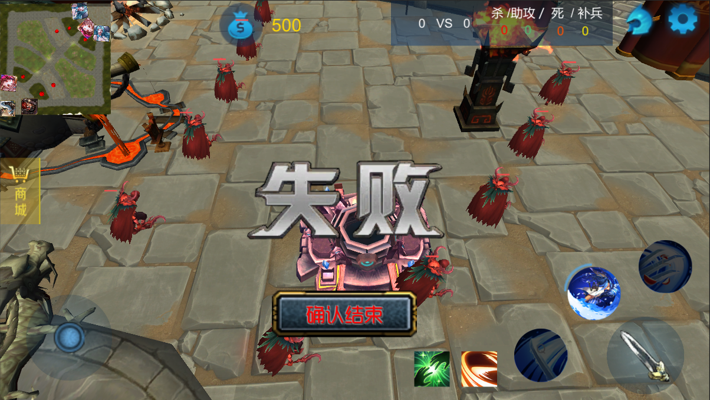
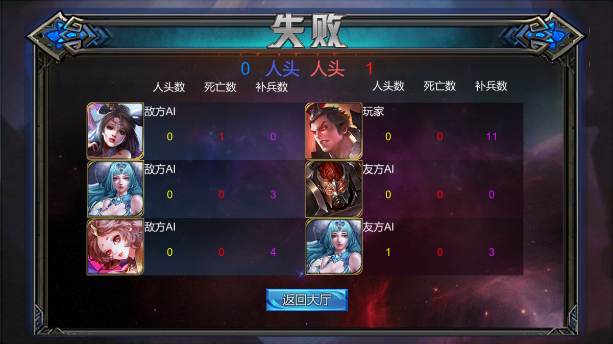

# The-Warring-State
a moba game using Unity3D

## 项目描述

战国是一个 MOBA 类游戏，以架空的历史为背景，为各方英雄提供了两个各有特色和玩法的地图作为鏖战场景，可以为玩家带来酣畅淋漓的战斗。

## 运行配置

- 支持平台：Mac Os / Windows xp+ / Android / IOS
- Unity 5.5

## 基本功能

- 账号系统；
- MOBA 类核心玩法（游戏模式选择，英雄选择，皮肤切换，自动导航，战争迷雾，AI）；
- 装备系统；
- 商城系统；
- 手游化UI系统；
- 数据统计系统；

## 游戏截图

- 登陆界面(利用JSON实现账号信息保存和读取)

- 模式选择（包括【联网】、【人机】和【随机英雄】模式选择）

- 角色选择（每个英雄独立的，头像、模型、技能图标展示，且一方不可重复选择英雄）

- 加载画面（利用异步加载方法，加载画面随机）

- 1V1场景（红蓝方随机）

- 3V3场景（红蓝方随机）

- 商城（多种装备，多种搭配）

- 装备栏（点击可呼出【卖出】按钮，属性值实时更新）

- 游戏画面

- 小地图表现（利用额外相机渲染，只渲染需要显示的地标、英雄图标等）

- 游戏失败（【设置】中可快速结束游戏，镜头移动至水晶位置，水晶播放失败动画）

- 统计界面（红蓝方对应显示位置）

